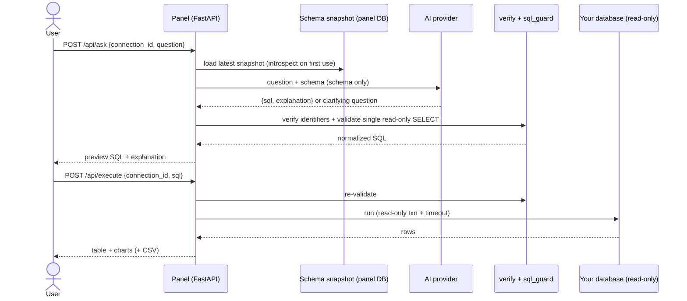
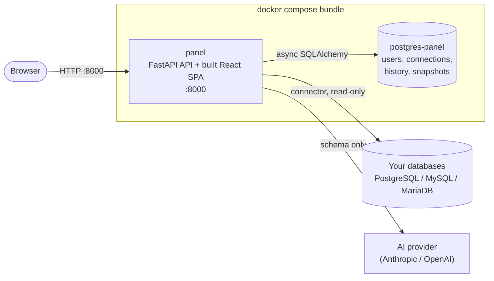

# Talk2Database

**Ask your own databases questions in plain language — preview the generated read-only SQL, then run it safely against your live data.**

Talk2Database is a self-hostable panel that turns natural-language questions into a single, **read-only** `SELECT`. Register a connection to your own PostgreSQL, MySQL, or MariaDB database, ask a question, preview the AI-generated SQL, and run it read-only against that database. Results come back as a sortable table plus basic charts, with per-user query history, CSV export, saved queries, a semantic glossary, and one-click re-run/edit.

It ships as a single `docker compose` bundle: a FastAPI + React panel and one PostgreSQL database for the panel's own metadata. Your data stays in your databases — the panel connects to them read-only at query time and never copies them in.

> Only your database **schema** is ever sent to the AI provider — no table rows, aside from two narrow, configurable exceptions: a small set of a column's distinct values for query grounding (`SCHEMA_SAMPLE_VALUES`, on by default; enum/CHECK values come from the catalog with no row reads) and an opt-in bounded row sample for result summaries (`AI_ALLOW_SAMPLE_ROWS`, off by default).

---

## Table of contents

- [Features](#features)
- [How it works](#how-it-works)
- [Architecture](#architecture)
- [Quickstart](#quickstart)
- [Environment reference](#environment-reference)
- [Connecting a database](#connecting-a-database)
- [Security model](#security-model)
- [Local development](#local-development)
- [Project structure](#project-structure)
- [Tech stack](#tech-stack)
- [Screenshots](#screenshots)
- [Contributing](#contributing)
- [License](#license)

---

## Features

- **Natural language → SQL.** Ask a question; get a single read-only `SELECT` with a plain-language explanation.
- **Bring your own databases.** Register connections to your own **PostgreSQL, MySQL, or MariaDB** databases at runtime — no copying data into the panel. Each user manages their own connections.
- **Preview before you run.** The generated SQL is shown and validated *before* execution — you stay in control.
- **Two-layer read-only safety.** Every query is parsed and validated as a single read-only statement *and* runs inside a read-only transaction with a statement timeout. Point a connection at a read-only database user for a third, hard boundary. See [Security model](#security-model).
- **Schema-aware generation with self-correction.** Generated SQL is checked against the real schema; if the model references a table or column that doesn't exist (or trips the guard), it is re-prompted with a correction up to `ASK_MAX_RETRIES` times before giving up.
- **Chat-style Ask flow.** Ask follows up with clarifying questions (and clickable interpretations) when a question is ambiguous, instead of guessing.
- **Schema-only AI grounding.** The provider sees table/column/key metadata only. Row data never leaves your infrastructure.
- **Low, predictable AI cost.** The schema is introspected once per connection and reused as a cacheable prompt prefix; oversized schemas are trimmed to the tables most relevant to your question. See [docs/architecture.md](docs/architecture.md).
- **Configurable AI provider.** Anthropic (Claude) or OpenAI, selected with one environment variable.
- **Browse & Query.** A DBeaver-style page to explore a connection's schema and run your own SQL in a CodeMirror editor (still read-only-guarded).
- **Results, charts & export.** Tabular results, simple charts (Recharts), and one-click CSV download.
- **AI-explained results.** One click summarizes a result set and suggests the best chart. By default only column names/types and locally-computed aggregates are sent to the model (the no-row-data promise stays the default); `AI_ALLOW_SAMPLE_ROWS` opts into a small bounded sample.
- **Cost preview.** Before running, see the planner's estimated cost/rows via `EXPLAIN` (not `EXPLAIN ANALYZE`) under the same read-only connection.
- **Saved queries (Questions library).** Bookmark a vetted query and re-run it without re-asking the AI.
- **Semantic layer.** Annotate tables/columns and define business metrics ("MRR = …") per connection; these ground the AI prompt for far better SQL on real schemas.
- **Suggested questions.** AI-generated starter questions per connection, cached on the schema snapshot so they refresh automatically when the schema changes.
- **Query history.** Per-user history of questions, generated SQL, and outcomes — with re-run and edit-then-run.
- **Admin audit feed.** Admins can review who asked what (questions + SQL only; never row data). Toggle with `ADMIN_AUDIT_ENABLED`.
- **Multi-user with roles.** First account bootstraps as admin; admins invite others via tokenized links. Passwords hashed with Argon2; JWT bearer auth. Connection secrets encrypted at rest with Fernet.
- **Self-hosted, single command.** `docker compose up -d --build` and you are running.

---

## How it works

```text
                ┌──────────────────────────────────────────────────────────┐
   "How many    │  1. ASK                                                  │
    orders did  │     question + cached schema snapshot  ──►  AI provider   │
    we ship     │                                            (schema only)  │
    last week?" │  2. PREVIEW                                               │
       ─────────►     generated SELECT  ──►  verify + sql_guard             │
                │  3. ACCEPT                                                │
                │     you review the SQL and click Run                      │
                │  4. EXECUTE                                               │
                │     run read-only against YOUR database + timeout         │
                │  ◄── rows + charts, saved to history, exportable as CSV   │
                └──────────────────────────────────────────────────────────┘
```

1. **Ask.** You pick one of your connections and type a question. The panel loads that connection's stored schema snapshot (introspected once, not per question), trims it to fit the token budget if needed, and asks the configured provider for one `SELECT`. When the question is ambiguous, the model can respond with a clarifying question instead.
2. **Preview.** The returned SQL is verified against the real schema (every table/column must exist) and validated by `sql_guard` as a single, read-only `SELECT`, then shown to you with an explanation. Nothing has touched your data yet — you can optionally run `EXPLAIN` for a cost estimate.
3. **Accept.** You review — and optionally edit — the SQL, then run it.
4. **Execute.** The statement is re-validated and executed against your database over a read-only connection with a statement timeout. Results are paged into a table and charts, recorded in history, and available as CSV.


```mermaid
sequenceDiagram
    actor U as User
    participant P as Panel (FastAPI)
    participant S as Schema snapshot (panel DB)
    participant AI as AI provider
    participant G as verify + sql_guard
    participant DB as Your database (read-only)

    U->>P: POST /api/ask {connection_id, question}
    P->>S: load latest snapshot (introspect on first use)
    P->>AI: question + schema (schema only)
    AI-->>P: {sql, explanation} or clarifying question
    P->>G: verify identifiers + validate single read-only SELECT
    G-->>P: normalized SQL
    P-->>U: preview SQL + explanation
    U->>P: POST /api/execute {connection_id, sql}
    P->>G: re-validate
    P->>DB: run (read-only txn + timeout)
    DB-->>P: rows
    P-->>U: table + charts (+ CSV)
```

---

## Architecture

Talk2Database runs as **two services** and **one database**:


```mermaid
flowchart LR
    subgraph Bundle["docker compose bundle"]
        Panel["panel<br/>FastAPI API + built React SPA<br/>:8000"]
        PanelDB[("postgres-panel<br/>users, connections,<br/>history, snapshots")]
    end
    Browser(["Browser"]) -->|HTTP :8000| Panel
    Panel -->|async SQLAlchemy| PanelDB
    Panel -->|"connector, read-only"| Sources[("Your databases<br/>PostgreSQL / MySQL / MariaDB")]
    Panel -->|schema only| AI["AI provider<br/>(Anthropic / OpenAI)"]
```

| Service          | Role                                                                                                        |
| ---------------- | ----------------------------------------------------------------------------------------------------------- |
| `panel`          | FastAPI JSON API under `/api` plus the built React SPA, on port `8000`. The only user-facing endpoint.       |
| `postgres-panel` | Panel metadata: users, invites, **connections** (with encrypted secrets), query history, saved queries, glossary, schema snapshots. |

Your data sources are **not** part of the bundle. Each user registers connections to their own databases through the UI; the panel opens a fresh **read-only** connection to a source only when it needs to introspect the schema or run a query, and never pools or persists row data.

For the request path, the schema-caching subsystem, and the panel DB schema, see **[docs/architecture.md](docs/architecture.md)**.

---

## Quickstart

### Prerequisites

- **Docker** with the Compose plugin (`docker compose`).
- An **AI API key** for Anthropic or OpenAI.
- A reachable **PostgreSQL, MySQL, or MariaDB** database to query (added later, from the UI).

### Steps

1. **Clone and create your env file.**

   ```bash
   git clone https://github.com/iamseyedalipro/Talk2Database.git
   cd Talk2Database
   cp .env.example .env
   ```

2. **Edit `.env`.** At minimum, set:
   - `AI_PROVIDER`, `AI_API_KEY`, `AI_MODEL` — your provider and credentials.
   - `JWT_SECRET` — a long random secret, e.g. `openssl rand -hex 32`.
   - `CONNECTIONS_SECRET_KEY` — a Fernet key used to encrypt stored connection passwords. Generate one:
     ```bash
     python -c "from cryptography.fernet import Fernet; print(Fernet.generate_key().decode())"
     ```
   - `PANEL_DB_PASSWORD` — a strong password for the panel's metadata database.

   See the full [Environment reference](#environment-reference) below.

3. **Bring up the stack.**

   ```bash
   docker compose up -d --build
   ```

   Equivalent Makefile target: `make up`.

   > **If the build fails fetching packages.** The build pulls Python packages
   > from PyPI and npm packages from the npm registry. On a slow or filtered
   > network you may see:
   >
   > ```
   > ReadTimeoutError(... host='pypi.org' ... Read timed out. (read timeout=15))
   > ERROR: Could not find a version that satisfies the requirement setuptools>=68
   >         (from versions: none)
   > ```
   >
   > `from versions: none` means the index could not be reached at all — the
   > package is not missing. The build already allows 120s per read and retries
   > 10 times, so a merely slow link should get through. If PyPI or the npm
   > registry is blocked rather than slow, point the build at a mirror you can
   > reach, either in `.env`:
   >
   > ```bash
   > PIP_INDEX_URL=https://<your-mirror>/simple
   > NPM_CONFIG_REGISTRY=https://<your-mirror>/
   > ```
   >
   > or on the command line:
   >
   > ```bash
   > docker compose build --build-arg PIP_INDEX_URL=https://<your-mirror>/simple
   > docker compose up -d
   > ```
   >
   > These are build-time only; the running panel never uses them.

4. **Open the panel** at <http://localhost:8000> and **create the first admin account.** The very first registration bootstraps as an admin; this is only available while no users exist. After that, admins invite additional users from the panel.

5. **Register a connection.** From the **Connections** page, add your PostgreSQL / MySQL / MariaDB database (host, port, database, user, password). Use **Test** to confirm the panel can open a read-only connection. See [Connecting a database](#connecting-a-database).

6. **Ask a question.** Head to the Ask page, pick your connection, and start querying in plain language.

> **Reaching a database on the host.** When the panel runs in Docker and you point a connection at `localhost`/`127.0.0.1`, it is automatically remapped to `host.docker.internal` so it resolves to your host machine rather than the container.

---

## Environment reference

Every variable lives in `.env` (copied from `.env.example`). The panel and its metadata database read from this single file. Data-source credentials are **not** here — they are entered per connection in the UI and stored encrypted. **Never commit your real `.env`** — it is gitignored.

### AI provider

| Variable            | Default          | Description                                                                                          |
| ------------------- | ---------------- | ---------------------------------------------------------------------------------------------------- |
| `AI_PROVIDER`       | `anthropic`      | Provider that converts natural language to SQL. One of `anthropic` or `openai`.                      |
| `AI_API_KEY`        | `replace-me`     | API key for the selected provider. `/api/ask` fails fast with a clear error if this is unset or still `replace-me`. |
| `AI_MODEL`          | `claude-opus-4-8`| Model id, e.g. `claude-opus-4-8` (Anthropic) or `gpt-4o` (OpenAI).                                   |
| `AI_ALLOW_SAMPLE_ROWS` | `false`       | For "Explain results" summaries only: also send a small bounded sample of result rows for richer summaries. Off by default (column metadata + local aggregates only). |
| `AI_SAMPLE_ROWS`    | `5`              | Maximum rows included when `AI_ALLOW_SAMPLE_ROWS=true`.                                               |
| `SCHEMA_MAX_TOKENS` | `6000`           | Token budget for the schema sent to the provider. If the serialized schema exceeds this, only the tables most relevant to the question (plus their FK neighbours) are sent. |
| `SCHEMA_TABLES`     | *(empty)*        | Optional comma-separated default table allowlist. Empty means all tables. A connection can override this in its options (e.g. `{"tables": ["orders", "customers"]}`). |
| `SCHEMA_INCLUDE_SCHEMAS` | *(empty)*   | Comma-separated default namespaces/schemas to introspect. Empty auto-discovers all user schemas. A connection can override this in its options. |
| `SCHEMA_SAMPLE_VALUES` | `true`        | Discover a column's allowed values so the AI filters on real values (e.g. `status = 'successful'`, not `'paid'`). Enum/CHECK values are always read from the catalog; when on, plain text columns are also probed with a bounded `SELECT DISTINCT`. Set `false` to stay strictly structure-only. |
| `SCHEMA_SAMPLE_MAX_VALUES` | `25`      | Keep at most this many distinct values per sampled column; columns with more are treated as free-text and left unannotated. |
| `SCHEMA_SAMPLE_SCAN_LIMIT` | `10000`   | Maximum rows scanned per column when sampling distinct values, to bound cost. |

### Ask flow

| Variable                  | Default | Description                                                                                     |
| ------------------------- | ------- | ----------------------------------------------------------------------------------------------- |
| `ASK_MAX_RETRIES`         | `2`     | How many corrective re-prompts to attempt when the generated SQL references non-existent identifiers or fails the guard. |
| `ASK_VERIFY_IDENTIFIERS`  | `true`  | Verify every table/column reference against the schema snapshot before previewing. Set `false` to disable the check. |
| `SUGGESTED_QUESTIONS_COUNT` | `5`   | How many AI-generated example questions to cache per schema snapshot.                            |

### Connection registry

| Variable                 | Default | Description                                                                                          |
| ------------------------ | ------- | ---------------------------------------------------------------------------------------------------- |
| `CONNECTIONS_SECRET_KEY` | *(empty)* | Fernet key used to encrypt each data source's password at rest. Generate with `python -c "from cryptography.fernet import Fernet; print(Fernet.generate_key().decode())"`. **Changing it after connections exist makes their stored passwords undecryptable.** |

### Authentication

| Variable             | Default                                | Description                                                            |
| -------------------- | -------------------------------------- | ---------------------------------------------------------------------- |
| `JWT_SECRET`         | `replace-me-with-a-long-random-secret` | HMAC secret used to sign JWTs. Generate with `openssl rand -hex 32`.   |
| `JWT_EXPIRE_MINUTES` | `60`                                   | Access-token lifetime, in minutes.                                     |
| `APP_BASE_URL`       | `http://localhost:8000`                | Base URL of the panel, used to build invite acceptance links.          |
| `CORS_ORIGINS`       | *(empty)*                              | Comma-separated extra browser origins allowed to call the API. Leave empty for the default single-container setup where the panel serves the SPA. |

### Query execution guard rails

| Variable                | Default | Description                                                                 |
| ----------------------- | ------- | --------------------------------------------------------------------------- |
| `QUERY_MAX_ROWS`        | `1000`  | Maximum rows returned per query (also the cap for CSV export and re-runs).   |
| `QUERY_TIMEOUT_SECONDS` | `30`    | Read-only session + `statement_timeout` (and idle-in-transaction timeout) applied to every query connection. |

### Admin audit feed

| Variable              | Default | Description                                                                              |
| --------------------- | ------- | ---------------------------------------------------------------------------------------- |
| `ADMIN_AUDIT_ENABLED` | `true`  | When enabled, admins can review every user's questions + generated SQL (never row data). Set `false` to hide the feed entirely. |

### Panel database (`postgres-panel`)

Stores users, invites, connections (with encrypted secrets), query history, saved queries, glossary, and schema snapshots. This is the only database the panel owns.

| Variable            | Default            | Description                     |
| ------------------- | ------------------ | ------------------------------- |
| `PANEL_DB_HOST`     | `postgres-panel`   | Hostname of the panel database. |
| `PANEL_DB_PORT`     | `5432`             | Port of the panel database.     |
| `PANEL_DB_NAME`     | `panel`            | Panel database name.            |
| `PANEL_DB_USER`     | `panel`            | Panel database user.            |
| `PANEL_DB_PASSWORD` | `replace-me-panel` | Panel database password.        |

---

## Connecting a database

A **connection** points the panel at one of your databases. Connections are owned per user; secrets are encrypted on the way in (Fernet) and never returned by the API.

Supported types: **`postgres`**, **`mysql`**, **`mariadb`**.

Each connection has:

- **name** — a label unique per user.
- **type**, **host**, **port**, **database**, **username**, **password**.
- **options** — source-specific extras, e.g. `{"schemas": ["public", "sales"]}` to scope introspection, or `{"tables": ["orders", "customers"]}` to allowlist tables. These override the `SCHEMA_INCLUDE_SCHEMAS` / `SCHEMA_TABLES` defaults for that connection.

From the UI you can **test** a connection (opens a read-only connection and runs a trivial query), **browse** its schema, and **refresh** the schema after a DDL change. The schema is introspected once and cached as a snapshot; a structural change creates a new snapshot version and refreshes cached suggestions automatically.

> **Recommended:** point each connection at a **read-only database user**. The panel enforces read-only best-effort at the session level, but the strongest boundary is a source-side role that simply cannot write. For example, in PostgreSQL:
>
> ```sql
> CREATE USER readonly_user WITH PASSWORD 'a-strong-password';
> GRANT CONNECT ON DATABASE your_db TO readonly_user;
> GRANT USAGE ON SCHEMA public TO readonly_user;
> GRANT SELECT ON ALL TABLES IN SCHEMA public TO readonly_user;
> ALTER DEFAULT PRIVILEGES IN SCHEMA public GRANT SELECT ON TABLES TO readonly_user;
> ```

---

## Security model

Read-only access is enforced as **defence in depth** — independent layers, none of which is the boundary on its own:

1. **Server-side SQL validation (`sqlglot`).** Every statement is parsed and must be a *single, read-only `SELECT`*. The validator rejects multiple statements, any DML/DDL, data-modifying CTEs, `SELECT ... INTO`, `FOR UPDATE/SHARE`, and a denylist of dangerous functions (file/large-object access, `pg_sleep`, `dblink`, …). The text executed is re-serialized from the validated AST. The same validator runs at preview time *and* again at execute time.
2. **Schema-aware identifier verification.** Before preview, every table/column reference in the generated SQL is resolved against the connection's schema snapshot (sqlglot scope analysis handles CTEs, aliases, subqueries, and set operations). Hallucinated identifiers trigger a corrective retry rather than a bad query.
3. **Read-only connections with timeouts.** Each query opens a fresh connection that sets `default_transaction_read_only = on`, `statement_timeout`, and `idle_in_transaction_session_timeout` (from `QUERY_TIMEOUT_SECONDS`). This is best-effort — the panel does not own your database — so it is a defensive layer, not the sole boundary.
4. **A read-only database user (recommended).** Because the source database is yours, the hardest guarantee is to give each connection a role that only has `SELECT`. See [Connecting a database](#connecting-a-database).

Additional guarantees:

- **Schema-only AI grounding.** Structural metadata (tables, columns, types, keys, comments) is sent to the provider. Two narrow exceptions surface small amounts of data-derived values: a bounded set of a column's **distinct values** for query grounding (`SCHEMA_SAMPLE_VALUES`, on by default — enum/CHECK values are read from the catalog with no row reads; only plain text columns are probed with a bounded `SELECT DISTINCT`, and set the flag to `false` to disable), and an opt-in bounded **row sample** for "Explain results" summaries (`AI_ALLOW_SAMPLE_ROWS`, off by default).
- **Secrets encrypted at rest.** Connection passwords are stored **Fernet-encrypted** in the panel DB (`CONNECTIONS_SECRET_KEY`) and are never returned by the API. Invite tokens are stored **hashed**; the raw token only ever lives in the invite link. Passwords are hashed with Argon2.

Full details — including the validator's reject list and operational notes — are in **[docs/security.md](docs/security.md)**.

---

## Local development

You can run the panel without Docker for fast iteration. You will need Python 3.12, Node 20, and a reachable Postgres for the panel database. Most workflows are wrapped in the [`Makefile`](Makefile) — run `make help` for the full list. There is also a hot-reload Docker overlay: `make dev-build` once, then `make dev`.

### Backend

```bash
cd backend
pip install -e ".[dev]"     # runtime + dev tooling (ruff, mypy, pytest)
alembic upgrade head        # apply panel-DB migrations  (or: make migrate)
uvicorn app.main:app --reload --port 8000   # or: make backend-dev
```

### Frontend

```bash
cd frontend
npm install
npm run dev                 # Vite dev server, proxies /api -> :8000  (or: make frontend-dev)
```

### Quality gates

| Command              | What it runs                                                        |
| -------------------- | ------------------------------------------------------------------- |
| `make lint`          | Backend `ruff check` + `ruff format --check` + `mypy`, frontend `eslint` + `tsc`. |
| `make test`          | Backend `pytest`, frontend `vitest`.                                |
| `make format`        | Auto-format backend (ruff) and frontend (prettier).                 |
| `make migrate`       | Apply Alembic migrations to the panel DB.                           |
| `make revision m="…"`| Create a new autogenerated migration.                               |
| `make up` / `make down` | Start / stop the Docker bundle.                                  |

See **[CONTRIBUTING.md](CONTRIBUTING.md)** for the full contributor workflow.

---

## Project structure

```text
Talk2Database/
├── backend/                  # Python 3.12 + FastAPI
│   ├── app/
│   │   ├── config.py         # env-driven settings
│   │   ├── main.py           # FastAPI app: /api + SPA
│   │   ├── cli.py            # maintenance commands
│   │   ├── deps.py           # auth dependencies
│   │   ├── db/               # panel DB (async SQLAlchemy)
│   │   ├── models/           # users, invites, connections, query_history, saved_query, glossary, schema_snapshots
│   │   ├── routers/          # auth, users, admin_audit, connections, glossary, ask, execute, history, saved_queries, results, system
│   │   ├── schemas/          # Pydantic request/response models
│   │   ├── connectors/       # per-source drivers: postgres, mysql/mariadb (+ factory)
│   │   └── services/
│   │       ├── ai/           # provider abstraction (anthropic, openai), prompts, generate loop
│   │       ├── schema/       # introspect, serialize, cache, relevance selection, glossary
│   │       ├── sql_guard.py  # single read-only SELECT validation
│   │       ├── sql_verify.py # identifier verification against the schema
│   │       ├── connections.py# build/load a connector from a stored connection
│   │       ├── crypto.py     # Fernet encrypt/decrypt of connection secrets
│   │       ├── explain.py    # EXPLAIN cost/row parsing
│   │       ├── results_summary.py
│   │       └── auth_service.py
│   ├── alembic/              # panel DB migrations
│   └── pyproject.toml
├── frontend/                 # React + TypeScript (Vite): Ask, Browse, Connections, History, Saved, Admin
├── docs/                     # architecture & security docs
├── docker-compose.yml
├── docker-compose.dev.yml
├── Makefile
└── .env.example
```

---

## Tech stack

- **Backend:** Python 3.12, FastAPI, SQLAlchemy 2 (async, asyncpg) for the panel DB, psycopg 3 (PostgreSQL) and PyMySQL (MySQL/MariaDB) for read-only data-source access, Pydantic / pydantic-settings, Alembic, `sqlglot` (SQL validation + identifier verification), `cryptography` (Fernet secret encryption), PyJWT, `pwdlib[argon2]` (password hashing).
- **AI:** Anthropic and OpenAI SDKs, with provider-agnostic structured output and prompt caching.
- **Frontend:** React 18 + TypeScript, Vite, React Router, Zustand, Recharts, CodeMirror (SQL editor).
- **Databases:** PostgreSQL 16 for the panel metadata; your own PostgreSQL / MySQL / MariaDB as data sources.
- **Packaging:** Docker / docker compose; multi-stage build (SPA → FastAPI runtime).

---

## Screenshots

Screenshots can be added under [`docs/screenshots/`](docs/screenshots/). Reference them here once available, for example:

```markdown


```

---

## Contributing

Contributions are welcome! Please read **[CONTRIBUTING.md](CONTRIBUTING.md)** for setup, coding standards, commit conventions, and the PR workflow, and our **[Code of Conduct](CODE_OF_CONDUCT.md)**. Security issues should follow the responsible-disclosure note in [docs/security.md](docs/security.md).

## License

Talk2Database is released under the [MIT License](LICENSE).
</content>
</invoke>
