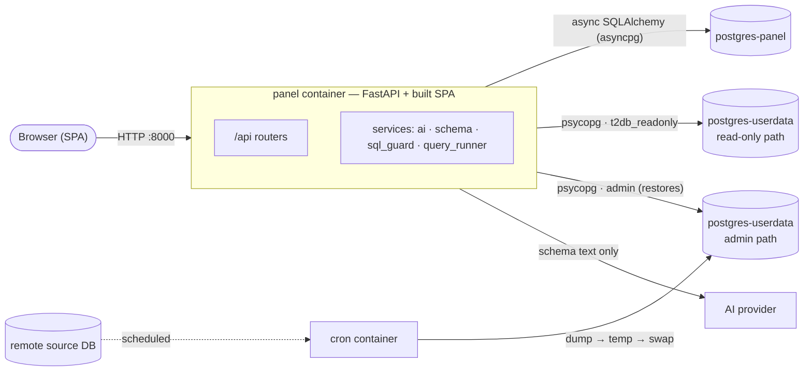
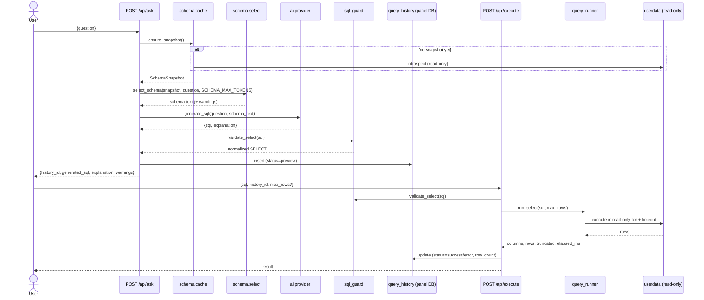
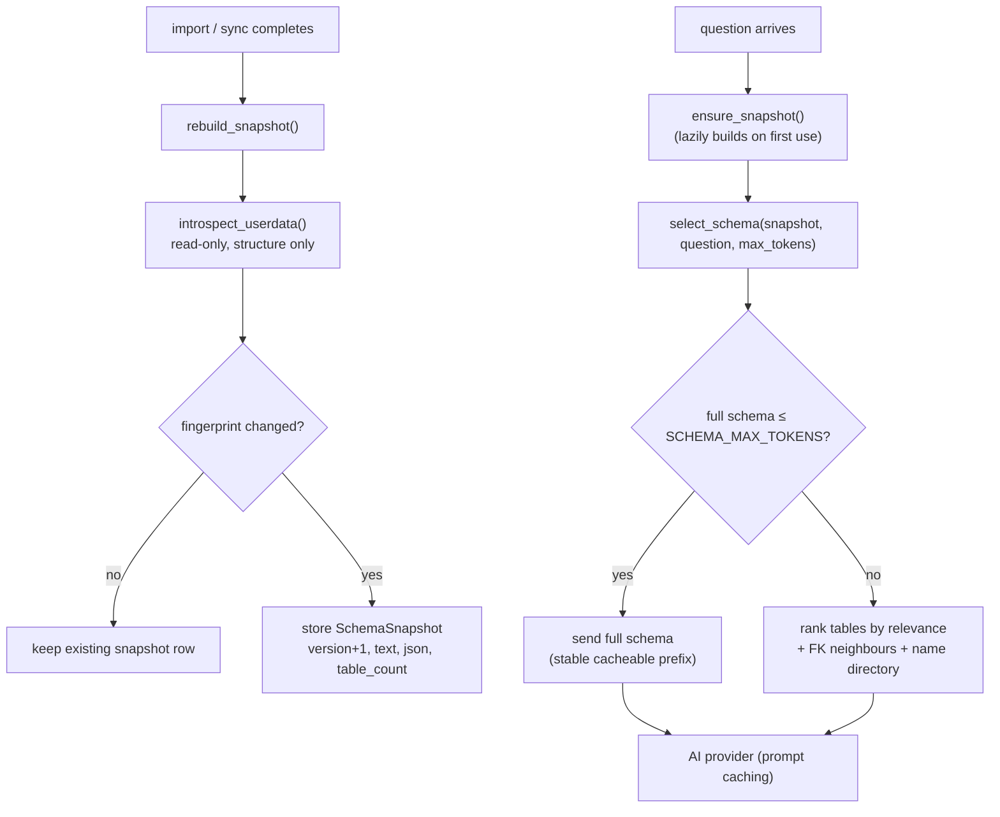
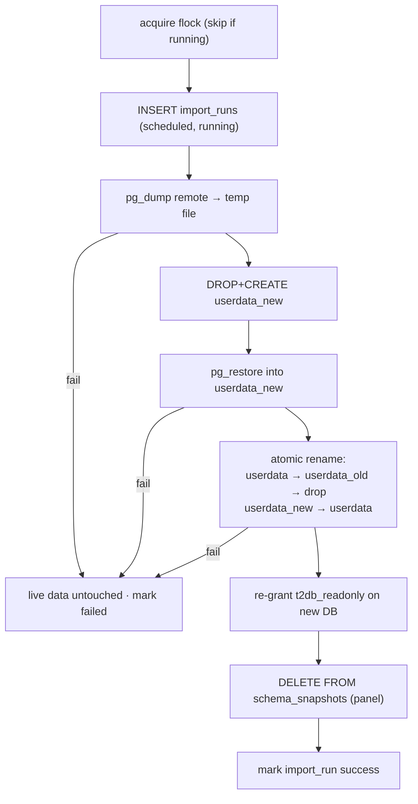
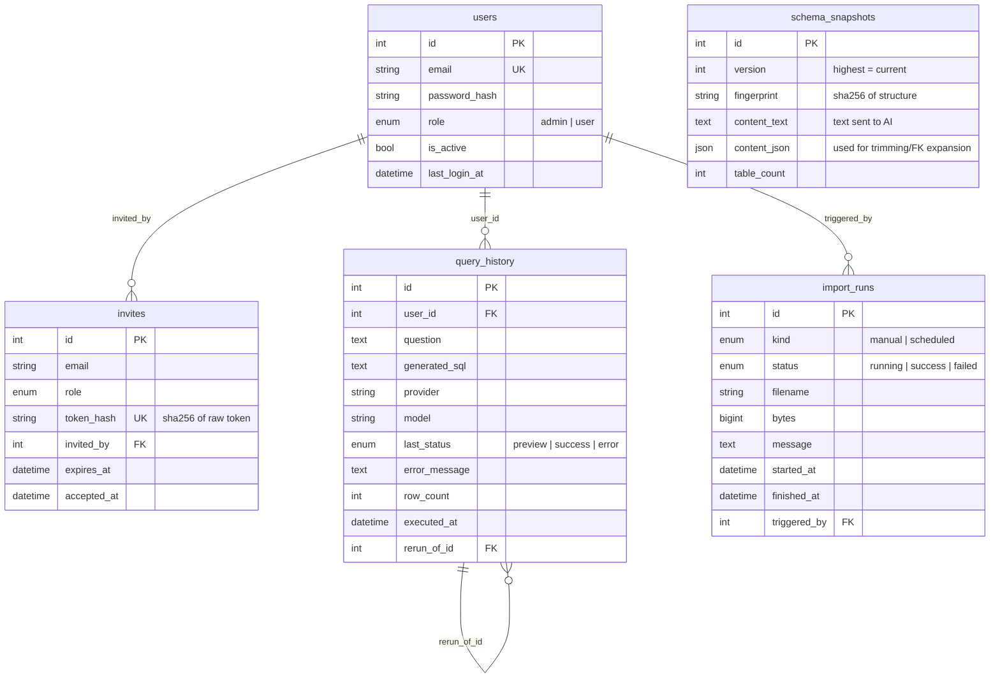

# Architecture

This document goes deeper than the [README](../README.md): the request path, the schema-caching subsystem, the two database layers, the import pipelines, and the panel database schema.

## Table of contents

- [Services overview](#services-overview)
- [The request path](#the-request-path)
- [Schema caching subsystem](#schema-caching-subsystem)
- [The two database layers](#the-two-database-layers)
- [Import pipelines](#import-pipelines)
- [Panel database schema](#panel-database-schema)
- [API surface](#api-surface)
- [Startup sequence](#startup-sequence)

---

## Services overview

The `panel` container builds the React SPA and serves it alongside the JSON API: the API lives under `/api`, and any other path falls back to `index.html` for client-side routing (`app/main.py`). The optional `cron` container only runs under the `scheduled` compose profile.

---

## The request path

The core flow has two API calls: **ask** (generate + preview) and **execute** (run the accepted SQL).

Notes:

- **Provider calls are synchronous SDK calls** wrapped in `run_in_threadpool`, so the async event loop is never blocked.
- **`/api/ask` validates the generated SQL too** — a `422` is returned if the provider somehow returns something that is not a single read-only `SELECT`. The same validator runs again at execute time.
- **History is created at preview time** with status `preview`, then updated to `success`/`error` after execution. Re-runs (`/api/history/{id}/rerun`) create a *new* history row linked via `rerun_of_id`, and may carry edited SQL.
- **Row caps.** Results are capped at `min(requested, QUERY_MAX_ROWS)`; the runner fetches `max_rows + 1` to set a `truncated` flag without scanning the whole result.

---

## Schema caching subsystem

The goal of this subsystem is **predictable, low AI cost**: introspect once, reuse a stable cacheable prefix, and trim only when a schema is too large.

### 1. Introspect once → snapshot

After every import/sync (and lazily on the first question if none exists), `rebuild_snapshot` calls `introspect_userdata`, which reads **only structural metadata** — table/column/type/nullability/comments, primary keys, and foreign keys — through the read-only connection. Nothing about row data is read.

The structure is serialized deterministically (`serialize_schema`) into a compact text block and hashed (`fingerprint`, SHA-256). If the new fingerprint matches the current snapshot, the existing row is kept (no churn). Otherwise a new `schema_snapshots` row is written with `version + 1`, the text, the structured JSON, and the table count.

Serving a question reads the **stored snapshot** — it never re-introspects the user-data DB per question.

### 2. Cacheable prefix

The serialized schema is sent as a stable *leading prefix* so provider prompt caching applies across repeated questions:

- **Anthropic:** the schema is a separate `system` block marked `cache_control: {"type": "ephemeral"}`, so its tokens are billed once and reused within the caching window (`app/services/ai/anthropic_provider.py`).
- **OpenAI:** the schema is placed in the leading `system` message so OpenAI's automatic prefix caching applies (`app/services/ai/openai_provider.py`).

Both providers force structured `{status, sql, explanation, clarification_question, suggested_interpretations}` output — Anthropic via a single tool call, OpenAI via a strict JSON schema response format. `status` lets the model ask the user a clarifying question (with clickable interpretations) instead of inventing tables when the question does not map to the schema.

### 2b. Verification and corrective retries

After generation, `verify_identifiers` (`app/services/sql_verify.py`) resolves every table and column reference in the SQL against the **full schema snapshot** using sqlglot scope analysis (CTEs, aliases, subqueries and set operations resolve natively). If the model hallucinated an identifier — or the statement failed the read-only guard — the orchestrator (`app/services/ai/generate.py`) appends the previous answer plus a corrective message (invalid identifiers, close-match suggestions, the table directory) to the conversation and retries, up to `ASK_MAX_RETRIES` times (default 2). The system prompt and schema block stay byte-identical across retries, so prompt caching still applies. If retries are exhausted the response carries `status: "verification_failed"` with the offending identifiers, and the last SQL is still shown for manual editing.

### 2c. Answer summaries and suggested questions

- `POST /api/summarize` (opt-in via `ANSWER_SUMMARY_ENABLED`) turns an executed result into a 1–3 sentence natural-language answer. It sends a server-side-capped sample of the result rows to the provider — the one deliberate exception to "schema only"; see docs/security.md.
- `GET /api/connections/{id}/suggested-questions` generates 4–6 example questions from the schema and caches them on the snapshot row, so a schema change (new snapshot version) refreshes them automatically.

### 3. Relevance trimming (only when needed)

`select_schema` estimates tokens (~4 chars/token). If the full schema fits within `SCHEMA_MAX_TOKENS`, **all of it is sent** (ideal — a stable, fully cacheable prefix).

If it does not fit, it sends only the most relevant tables:

1. Score every table against the question using token overlap (table/column names + comments), name-substring matches, and trigram similarity on the table name.
2. Greedily add the highest-scoring tables until the budget (minus a compact `TABLES: …` directory of all names) is exhausted.
3. Pull in **foreign-key neighbours** of the selected tables, so joins referenced by the query still resolve.
4. Prepend the full table-name directory so the model knows what else exists, and attach a user-facing warning ("Sent the N tables most relevant to your question…").

This bounds per-question cost while keeping joins answerable.

---

## The two database layers

Talk2Database deliberately uses **two different access patterns** for its two databases.

### Panel DB — async SQLAlchemy

`app/db/panel.py` builds a process-wide async engine (`postgresql+asyncpg://…`) with `pool_pre_ping=True`, plus an `async_sessionmaker`. The `get_session` FastAPI dependency yields a session that is **committed on success and rolled back on any exception**. Alembic uses a separate synchronous DSN (`postgresql+psycopg://…`). All panel reads/writes — users, invites, history, import runs, snapshots — go through this layer.

### User-data DB — psycopg, read-only

`app/db/userdata.py` exposes `readonly_connection()`, a context manager that:

- Connects with the **read-only role DSN** (`t2db_readonly`).
- Sets `default_transaction_read_only = on`.
- Sets `statement_timeout` and `idle_in_transaction_session_timeout` to `QUERY_TIMEOUT_SECONDS` (so a runaway AI query cannot hang the panel).

This is the **only** path the request-serving API uses to touch user data — for query execution (`query_runner`), CSV streaming (`csv_export`), and schema introspection. The admin DSN (`userdata_admin_dsn`) is used **only** by restores and by `readonly_role.ensure_readonly_role()`, and never enters the request path.

Result values are converted to JSON-serializable forms (`to_jsonable`): `Decimal → float`, dates/times → ISO strings, `bytes → \x…` hex, `UUID → str`, lists/dicts passed through.

---

## Import pipelines

Both pipelines end the same way: **re-grant the read-only role** (grants do not survive a restore) and **rebuild/invalidate the schema snapshot**.

### Manual (background task)

`POST /api/imports/upload` (admin only, manual mode only) streams the upload to a temp file in chunks, records an `import_runs` row with status `running`, and returns `202 Accepted` immediately. A FastAPI background task (`process_manual_import`) then:

1. **Detects the format** from leading bytes — `PGDMP` → custom, `ustar` marker → tar, else plain SQL.
2. **Restores** with the admin DSN: `psql -v ON_ERROR_STOP=1 -f` for plain dumps, or `pg_restore --clean --if-exists --no-owner --no-privileges` for custom/tar.
3. On success, **re-grants** the read-only role (`ensure_readonly_role`) and **rebuilds** the schema snapshot.
4. Updates the `import_runs` row to `success`/`failed` with a captured output tail, and deletes the temp file.

### Scheduled (cron full-refresh swap)

The `cron` container renders its crontab from `SYNC_INTERVAL_HOURS`, optionally runs one sync on startup, and runs `cron/sync.sh` on schedule. The sync is built so a failure never breaks live data:

Because the remote is dumped first and restored into a *fresh temp database*, the live `userdata` database is only touched by an atomic `ALTER DATABASE … RENAME`. A mid-sync failure leaves the live database intact. After the swap, the read-only role is re-created/re-granted (the cron grants mirror `app/services/readonly_role.py`), and the panel snapshot is deleted so the next question rebuilds it.

> The cron image is based on `postgres:16` so its `pg_dump`/`pg_restore` match the server major version. The remote source major version must be `<=` the user-data major version.

---

## Panel database schema

All panel tables are created from the SQLAlchemy models (`alembic/versions/0001_initial.py`). Most carry `created_at`/`updated_at` (via `TimestampMixin`).

Key points:

- **`users`** — `email` is unique and indexed; `role` is `admin`/`user`; the first registration bootstraps an admin while no users exist.
- **`invites`** — only the **hash** of the invite token is stored (`token_hash`); the raw token lives only in the emailed/shared link. Invites have a TTL (7 days) and a single-use `accepted_at`.
- **`query_history`** — indexed on `(user_id, created_at)`; `rerun_of_id` self-references to chain re-runs.
- **`import_runs`** — written by both the manual background task and the cron sync (the latter via direct `psql` INSERT/UPDATE).
- **`schema_snapshots`** — monotonically increasing `version`; the highest version is the current schema. Holds both the AI-facing text and the structured JSON used for trimming.

---

## API surface

All endpoints are under `/api`. A health check lives at `GET /api/health`.

| Group     | Endpoints                                                                                       |
| --------- | ----------------------------------------------------------------------------------------------- |
| `auth`    | `GET /auth/bootstrap-available`, `POST /auth/bootstrap`, `POST /auth/register`, `POST /auth/login`, `GET /auth/me` |
| `users`   | `GET /users`, `POST /users/invite`, `DELETE /users/{id}` (admin only)                            |
| `ask`     | `POST /ask`                                                                                      |
| `execute` | `POST /execute`, `POST /execute/csv`                                                             |
| `history` | `GET /history`, `GET /history/{id}`, `POST /history/{id}/rerun`                                  |
| `imports` | `POST /imports/upload`, `GET /imports`, `GET /imports/{id}` (admin only)                         |
| `system`  | `GET /system/status`                                                                             |

Auth is JWT bearer; admin-only routes additionally require the `admin` role.

---

## Startup sequence

The panel container entrypoint (`backend/scripts/entrypoint.sh`):

1. `alembic upgrade head` — migrate the panel DB.
2. `python -m app.cli ensure-readonly-role` — create/refresh the SELECT-only role (best effort; retried after the first import if it fails).
3. `python -m app.cli rebuild-schema` — build an initial snapshot (best effort; no-op if no data yet).
4. `uvicorn app.main:app` on `:8000`.

The AI provider and its credentials are validated lazily on first use (`validate_ai_config`), so the panel starts even before an AI key is exercised, but `/api/ask` will fail fast with a clear error if the key is missing.
